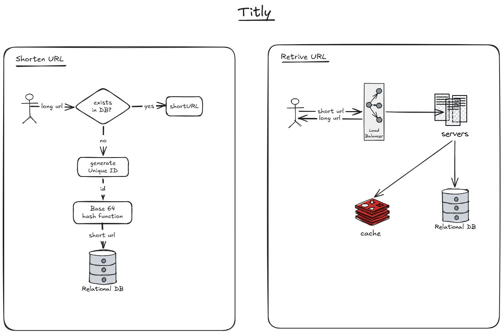

# Titly

Titly is a high-performance URL shortener built with Go, Redis, SQLite, and SvelteKit.

## Features

* Fast URL shortening and redirection
* Redis caching for low-latency lookups
* SQLite persistence
* Concurrent request handling using Go
* Returns an existing short URL when the same long URL is submitted
* Docker Compose setup for running the complete application

## Architecture

Titly consists of three main components:

* **Client** — SvelteKit frontend
* **Server** — Go REST API
* **Redis** — Cache for short URL mappings

The server checks Redis first when resolving a short URL. On a cache miss, it falls back to SQLite and caches the mapping in Redis for 24 hours.



## Tech Stack

* **Backend:** Go
* **Frontend:** SvelteKit
* **Database:** SQLite
* **Cache:** Redis
* **Containerization:** Docker & Docker Compose

## API

The server exposes the following endpoints:

| Method | Endpoint            | Description                      |
| ------ | ------------------- | -------------------------------- |
| `GET`  | `/`                 | Returns a welcome message        |
| `POST` | `/create-short-url` | Creates or retrieves a short URL |
| `GET`  | `/:short-url`       | Redirects to the original URL    |

See the [Server API Documentation](server/README.md) for request and response details.

## Running with Docker

Start the complete application using Docker Compose:

```bash
docker compose up --build
```

The services are available at:

* **Client:** `http://localhost:4173`
* **Server:** `http://localhost:4000`
* **Redis:** `localhost:6379`

To stop the application:

```bash
docker compose down
```

## Project Structure

```text
titly/
├── client/          # SvelteKit frontend
├── server/          # Go backend and API
├── docker-compose.yml
└── README.md
```

## License

This project is available under the repository's license.
